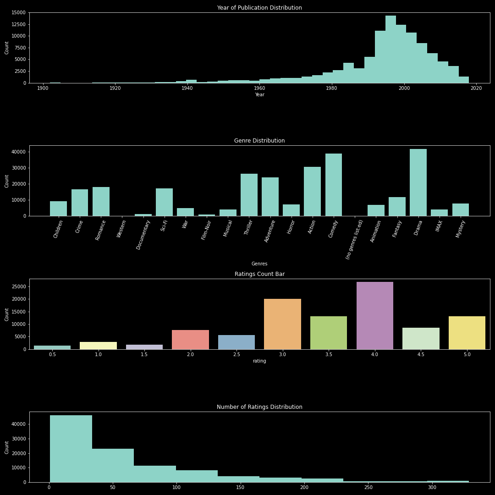
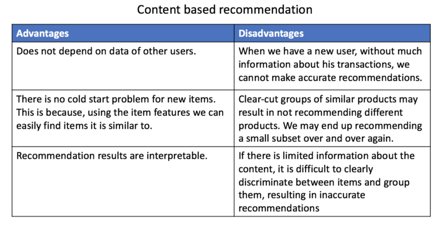

# MovieLens Recommendation System

-Cameron T. Ladd

# Data

 
This data is collected from the MovieLens dataset, which is created and curated by a research lab known as Grouplens Research. Grouplens Research is associated with the equally named website "Grouplens", which describes itself as 'a web site that helps people find movies to watch." 

The data is composed of 100,000 ratings and 3,600 tag applications applied to 9,000 movies by 600 users. It was last update in September of 2018.
The data files used are the 'movies.csv, 'ratings.csv', and 'tags.csv' from the "Small" version of the dataset.

# Goal

 
Using this data, the goal of this project is to create both a Collaborative and Content-based recommender system. 

# Data Cleaning and Manipulation

 
This dataset was very clean and well organized, with zero missing values. In order to conduct proper visualizations, several different subsets were created in order to construct the visualizations you see in this report. In the notebook, those subsets are clearly defined in the cell before the visualizations. Genres had to be extracted using the str.split() function, and then a loop was used to calculate the number of occurences, with the calculated values being placed in a dictionary called "dic". A new column, "Year of Publication" was created for clarity for visualizations. For the content-based model, a merge between the "tags" and  "movies" was necessary, and in order for the merge to not have any duplicates, those duplicates had to be dropped. The DataFrames were merged on the "movieId" column. Another column was created in the content-based filtering DataFrame that combined all the attributes of the movies given (genres and tags).

# Visualizations

Using these visualizations, we can make several conclusions concerning the data!

1. Most movies in this dataset were made around the year 2000. 
2. The three most frequent genres are drama, comedy, and action. There are no surprises there, as Western films tend to lean towards these highly successful genre choices. 
3. Most of the movies were rate at a 3 or a 4. Many less movies were rated between 0.5 and 2.5, which potentially indicates that this dataset had a decent selection of movies!
4. A lot of movies didn't have a lot of ratings. The most ratings you'll find for one movie is roughly 300 ratings. On average, movies were rated between 1 and 50 times!

# Modeling the Recommendation Systems

 

**EVALUTATION METRIC**

 

For our modeling, we will be using RMSE for our data! RMSE is an excellent evaluation metric for when you want to penalize larger errors. This means that it is best to use RMSE if a bigger error means more to your problem in context than a smaller error. If a smaller error were to be just as detrimental as a larger error, then MAE could be used.

In our case, we are using ratings. Let's say a user gave a rating of 10, and we had two models, with model 1 predicting a rating of 5 and model 2 predicting a rating of 2. Model 2 has a larger error, in the context of ratings, this means a lot. A movie with a recommendation of 2/10 is abysmal, while a movie with a recommendation of 5 can be considered mediocre. For all of us movie watchers, those ratings say very different things! This insinuates that larger error has a larger effect on the problem in context, and therefore RMSE is preferred.

Using this metric, we can cross validate 8 different models in order to find the one with the lowers RMSE, therefore making it our best model!
We cross-validated three different categories of models:
1. KNN Based
2. Matrix Factorization Based
3. Other (SlopeOne and CoClustering)
 

KNN Based and Matrix Factorization are well-known methods, so I will just explain the "other" methods that I used.
 

SlopeOne - Essentially, instead of using linear regression from one item's ratings to another item's ratingsit uses a simpler form of regression with a single free parameter.The free parameter is then simply the average difference between the two items' ratings. It was shown to be much more accurate than linear regression in some instances.
 

CoClustering - "Where classical clustering methods assume that a membership of an object (in a group of objects) depends solely on its similarity to other objects of the same type (same entity type), co-clustering can be seen as a method of co-grouping two types of entities simultaneously, based on similarity of their pairwise interactions."
(https://datasciencemadesimpler.wordpress.com/tag/co-clustering/#The_CoClustering_problem)
 
 

The model with the lowest RMSE is SVD++, so we will use that for our collaborative filtering!

- Recommendation systems are one of the most useful applications of machine learning. Using either collaborative or content-based filtering methods, someone who implements one of these models can determine what products to suggest to a customer or viewer of content.

- Recommendation systems are everywehere! Almost everyone who involves themself in some aspect of the digital world used recommendation systems consistently without even knowing it.
  
1. How do you think Netflix knows which movies to suggest to you? Well, because you watched "The Lion King" 20 times last month, it is going to recommend movies similar to the Lion King! This is an example of a content-based recommendation system.

2. How do you think Amazon suggests items you potentially might like? It might compare you to other users who have bought similar items, and then see what items they have bought that you haven't yet. This is an example of a collaborative recommendation system.

## Collaborative vs Content-Based

### Collaborative

Collaborative filtering is the most common form of recommendation systems. So common, that it is usually insinuated that you are using collaborative filtering when you are referencing recommendation systems in general. The idea is that you take the information concerning user's preferences and a specific metric such as "ratings", and convert this information for ALL users into a matrix. This matrix will have missing value for the items that a customer did not rate, and the job of the recommendation system is to use the data to find these missing values, and then make recommendations based on the findings.
 
So if there were 5 movies that a person had not seen yet, and the recommendation system gave the 5 movies a rating of 1/5, 2/5, 3/5, 4/5, 5/5 respectively, the recommender system would choose the movie that it predicts the person would rate the highest: in other words, it would recommend the movie that it thinks you would like most!!
 

SVD++ was used to reduce the movies in the dataset to their latent features. Using those latent features, a recommendation system was created that predicts movies that a user may like depending on the similarity between the values calculated by SVD++

### Content-Based

With content-based filtering algorithms, you are given user's preferences, and then using those preferences, you identify items that relate most closely to the attributes of the preferred items.
 

Here is an example:
 

You decide to watch a Disney movie on Netflix. Netflix then could use a content-based filtering method to make recommendations of movies with similar attributes to a Disney movie.
 

What attributes does a Disney movie have? Some could say a Disney movie could be described as:
- Funny
- Musical
- Inspiring
Also a genre could be specified, such as being in the "family" genre
 

So the recommendation system will use these attributes and find other movies with the same attributes or similar ones!
 

For our recommendation system, we will not have to use the "tags" DataFrame that we did not use in our previous recommendation system that used collaborative filtering.
 

TFIDF was used to assign TFIDF scores to all of the attributes of the movies, and a similarity matrix was constructed in order to create a recommendation system. The recommendation system is in the form of a function.

# Conclusion

When constructing recommendation systems for the MovieLens dataset, TFIDF was used to create the Content-Based Recommendation System, and SDV++ was used to create the Collaborative Recommendation System. 
 

The function for the Content-Based Recommendation System is:
 

recommend(movie title, desired number of recommendations)

The function for the Collaborative Recommendation System is:

~~~
list_of_movies = []
for m_id in movies.reset_index()['movieId'].unique():
    list_of_movies.append((m_id, j.predict(1000,m_id)[3]))
# order the predictions from highest to lowest rated
ranked_movies = sorted(list_of_movies, key=lambda x:x[1], reverse=True)

# return the top n recommendations using the 
def recommended_movies(user_ratings,movie_title_df,n):
        for idx, rec in enumerate(user_ratings):
            title = movie_title_df.loc[movies.reset_index()['movieId'] == int(rec[0])]['title']
            print(title)
            n-= 1
            if n == 0:
                break
            
recommended_movies(ranked_movies,movies.reset_index(),5)
~~~
You must change the first value in the j.predict() part of the for loop to change the user that the recommendation system is targeting with its recommendations.

### Content-Based Top 5 Recommendations (Toy Story (1995))

1. "Bug's Life, A (1998)",
2. 'Toy Story 2 (1999)',
3. 'Sintel (2010)',
4. 'Up (2009)',
5. 'Jumanji (1995)'

### Collaborative Top 5 Recommendations (User 1000)

 

1. Shawshank Redemption, The (1994)
2. Streetcar Named Desire, A (1951)
3. Lawrence of Arabia (1962)
4. Dr. Strangelove or: How I Learned to Stop Worr...
5. Philadelphia Story, The (1940)

# Future Plans

A good idea would be to put these recommendation systems into a streamlined app that allows for easy use. At the current moment, it is all functions, which to the layman could be very hard to navigate. Furthermore, the bigger datasets could be using applying the same logic as we did to the smaller datasets, potentially resulting in a more robust model.